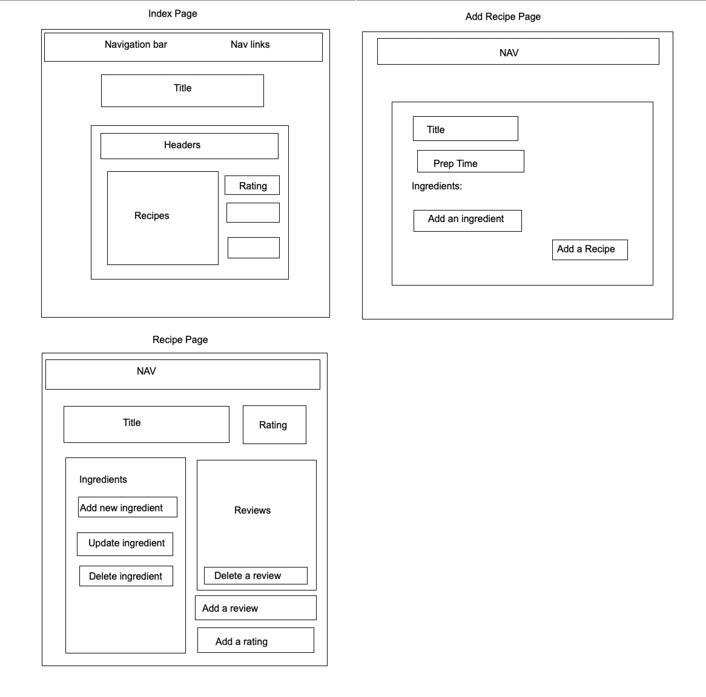

# Title: Hong Kong Lemon Tea - Recipe
Creator: Brian Lee

#### Check it out https://recipes-production-f0b0.up.railway.app

## Patch v1 Notes

This is the initial launch of HKLT - Recipe. 

## Background info:

This is a project I started for a Software Engineering bootcamp @GeneralAssembly.
HKLT - Recipe is inspired for my current obsession to the Hong Kong native drink.
In dedication to my search for the perfect recipe, I hope you are able to explore and enjoy.

## Description:

### Theme: Simple

#### Home Page

#### Index Page

#### Add Recipe Page

#### Details Page

#### Edit Page

# recipes
2nd project

#Trello link:
https://trello.com/b/PbuJ7AuQ/project-2

#Initial Wire Frame:

#

Next Steps:
Icebox from Trello (link above):
The goal is really to nail the best recipe. until then next steps would be user experience i.e. background music for the home page, "add image" section, and hiring a designer to beautify the webpage. After the perfect recipe is crafted, we can start to explore new pages. Starting with the next obsession (viet iced coffee) and a 18+ page for alcoholic drinks possibly. I don't want to lose focus so I want to make sure for now we are hyper obsessed with 1 drink.

## Technologies used:

Javascript, HTML, CSS, MongoDB, Mongoose, Express.js, Node.js, Google OAuth 2.0, MongoDB Atlas, Railway.app

## Credits:

1. Materialize.css
2. Google Fonts
3. @teabagcartoon on tenor for the qtlemonpi
